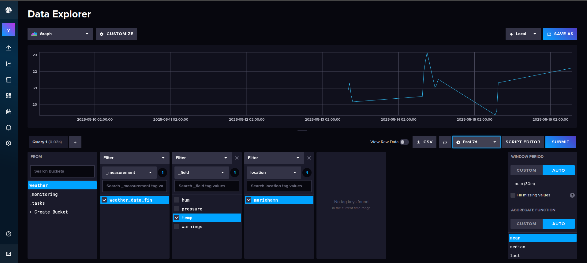

# Projektdokumentation

## 1. Aktueller Projektstand

- **Screenshots und Bilder**  
  

- **Was erreicht wurde:**
  - MQTT-Subscriber in Python erfolgreich implementiert
  - Geplante Mysql Datenbank durch InfluxDB ersetzt.
  - Sensordaten (Temperatur, Luftfeuchtigkeit, Luftdruck) werden verarbeitet und gespeichert
  - Automatische Erkennung und Protokollierung von Warnungen bei Grenzwertüberschreitungen
  - Strukturierte Einträge in der InfluxDB mit mehreren Feldern
  - PHP-api stellt über Endpunkte Daten als JSON zur verfügung

- **Potentielle Ausbaumöglichkeiten**
  - E-Mail- oder Benachrichtigungssystem bei Warnungen
  - Automatische Langzeitauswertung
  - Unit/Integration Testing

## 2. Reflexion

- **Probleme bei der Entwicklung**
  - Die Servermigration von Würzburg nach Marienhamn hat die Entwicklung,Datenerhebung und das Testen des Gesamtsystems verzögert.
  - Einstieg in InfluxDB komplexer als erwartet
  - Technische Probleme bei der Container-Kommunikation (z. B. DNS-Auflösung)

- **Was habe ich aus dem Projekt gelernt?**
  - Praxisnahe Anwendung von MQTT und Datenverarbeitung in Python
  - Umgang mit Docker und Docker-Compose zur Containerisierung
  - Verständnis für Zeitreihendatenbanken (InfluxDB) und deren Aufbau
  - Bedeutung von Logging und strukturiertem Debugging
